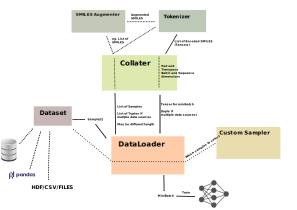

.. PySMILESUtils documentation master file, created by
   sphinx-quickstart on Wed Mar 10 13:00:41 2021.
   You can adapt this file completely to your liking, but it should at least
   contain the root `toctree` directive.

#############
PySMILESUtils
#############

PySMILES utilities is a package of tools for handling encoding and decoding of SMILES for deep learning applications in PyTorch. It's very modular with the intent of being flexible and adaptible to different needs. Tokenizers provide the means of splitting SMILES strings into tokens and encode them into lists of integers. Augmentation classes can provide SMILES augmentation. PyTorch compatible datasets makes it easy to handle different data needs, as example datasets too large to fit in memory. PyTorch compatible dataloaders can provide minibatches of samples. Custom collate functions can prepare the augmented, tokenized, encoded, padded and transposed Tensors for training. Training can be sped up by minimizing padding, using custom sampling that batches up similar length sequences.

The objects relations and tasks are illustrated in the figure below. Data is abstracted via the Dataset object, which provides samples one by one to the DataLoader. The DataLoaders task is to create mini-batches out of the data, it uses a collate function to turn lists of samples into minibatch tensors, and a sample strategy which can also be customized if needed. If multiple data types is provided by the Dataset (e.g. features and target) a list of tuples will be sent to the collate function. The collate function takes the lists of samples and turns them into a dense tensor. The collate function is an efficient place to customize augmentation and tokenization using the Tokenizer and Augment objects. The objects and the variants provided are described further below, and there are also some #%% delimited python files in the examples directory which exemplifies their usage.

Dataset
=======
The datasets is a PyTorch dataset which is an abstraction of the data, and will usally need adaptations for the project. The __getitem__ function will load and return a given sample, be it from a database, a directory, an internal pandas dataframe, CSV files etc. The __len__ provides the length of the dataset (needed for the dataloader). The objects are subclasses of PyTorch `Dataset <https://pytorch.org/docs/stable/data.html>`_

Variants of datasets in PySMILESUtils:

:class:`pysmilesutils.datautils.StringDataset`
   A simple base class that takes one or more lists of similar length, that will be returned as tuples of samples. Custom

:class:`pysmilesutils.datautils.SMILESDataset`
   A StringDataset for SMILES that also have a property with a list of indices sorted by SMILES length (e.g. for :class:`.BucketBatchSampler`)

:class:`pysmilesutils.datautils.MultiDataset`
   A `Dataset` that can cycled through to expose different data each step. This is useful if it's necessary to preaugment data, and switch between the augmented datafiles for each epoch.

:class:`pysmilesutils.datautils.PickledMultiDataset`
   A multidataset that reads data from a provided list of pickled dataframes. This way only one dataset is loaded at a time into main memory

DataLoader
==========

The dataloader is what is holding everything together. The dataloaders task is to iterate through and provide the data as mini batches ready for training. Several helper classes are available to customize the default behavior of the pytorch dataloader. (see figure above). Most of the times the default pytorch dataloader will just be customized with e.g. a custom collate function or a custom sampler. The DataLoaders are subclasses of PyTorch `DataLoaders <https://pytorch.org/docs/stable/data.html>`_

Variants of the DataLoaders in PySMILESUtils:

:class:`pysmilesutils.datautils.BlockDataLoader`
   A DataLoader that loads data in blocks, and can apply shuffling within these blocks. This is useful of the data is too large to fit in memory, but reading single samples by random is too slow.

Collater
========

The collater is a helper class to the dataloader that provides a means of getting a list of samples, and turning them into tensors. If the data is not regular, e.g. if the SMILES are not of equal length, this must be customized. The benefit from not padding all SMILES to similar length for the dataset, is that minibatches with minimal padding can be created which will speed up training. This is also the last place to do on-the-fly data augmentation and tokenization of the SMILES strings. The collater will often need to be customized for the specific project. A general example for SMILES are provided.

:class:`pysmilesutils.datautils.SMILESCollater`
   Collater for SMILES strings with optional augmentation. If an augmenter is provided, it can be switched on and off by setting the augment property to True or False. The collater will do the same tokenization and augmentation on all parts of the sample tuples provided

Augmenters
================

The smiles augmenter :class:`pysmilesutils.augment.SMILESAugmenter` can be used to augment SMILES strings. This is useful to prevent overfitting and in general improves performances of SMILES based deep learning. Example references: `https://arxiv.org/abs/1703.07076 <https://arxiv.org/abs/1703.07076>`_ and `https://doi.org/10.3390/biom8040131 <https://doi.org/10.3390/biom8040131>`_

Tokenizers
===========
The tokenizers chops up the SMILES strings into tokens of one or more characters and subsequently encode these into a list of integers using a vocabulary. An example of how it can be done is found in :class:`pysmilesutils.tokenize.SMILESAtomTokenizer`. The SMILES tokens can either be provided explicit or as token_patterns defined by regular expressions. The tokens and token_patterns are then used to analyze the provided list of SMILES (the full dataset usually), and all tokens found are added to the vocubulary. 

Samplers
========

Most of the times random sampling is used, but by sampling in a smarter way training speed can be significantly improved. The :class:`pysmilesutils.datautils.BucketBatchSampler` does smart sampling from "buckets" of similar length SMILES. This way excessive padding is avoided in the mini-batches and training times can improve significant(1.5x-2x).

########
Examples
########

Some notebooks (#%% delimited) are provided in the "Examples" directory, with examples of how to use the different classes for training. A simple transformer implementation is also provided for demonstrating end-to-end training on a small reaction prediction task.

.. toctree::
   :maxdepth: 2
   :caption: Contents:

   modules

##################   
Indices and tables
##################

* :ref:`genindex`
* :ref:`modindex`
* :ref:`search`
